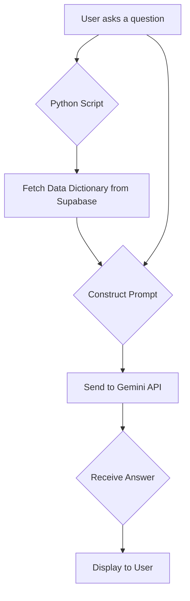

# Project: AI-Powered Data Dictionary Q&A

## 1. Overview

This document outlines the architecture and implementation of a Python-based application that leverages a Large Language Model (LLM) to answer questions about a data dictionary. The application connects to a Supabase PostgreSQL database to retrieve data dictionary information, which is then used as context for the Gemini AI to generate accurate, context-aware answers to user queries.

The primary goal is to create a flexible and easy-to-understand system that allows developers to quickly get answers about data definitions, formats, and other metadata without manually searching through files.

## 2. Core Technologies

*   **AI Agent:** Google Gemini
*   **Database:** Supabase (PostgreSQL)
*   **Programming Language:** Python

## 3. Application Flow

The application follows a straightforward sequence of operations:

1.  **Initialization**: The script loads necessary credentials (API keys for Gemini and Supabase) from environment variables.
2.  **User Input**: The user provides a natural language question about the data dictionary (e.g., "What is the data type for 'user_id'?").
3.  **Fetch Data Dictionary**: The script connects to the Supabase database and fetches the entire data dictionary. This data will serve as the context for the AI.
4.  **Prompt Engineering**: A carefully crafted prompt is constructed. This prompt includes the user's question and the data dictionary context retrieved from the database.
5.  **AI Interaction**: The complete prompt is sent to the Gemini API.
6.  **Generate Response**: The Gemini model processes the prompt and generates an answer based on the provided context.
7.  **Display Answer**: The script prints the AI-generated answer to the console for the user.

## 4. Implementation Steps

### Step 4.1: Supabase Setup

1.  **Create a Table**: In your Supabase project, create a new table to hold the data dictionary (e.g., `data_dictionary`).
2.  **Define Columns**: Define columns that match your data dictionary's structure (e.g., `term`, `definition`, `data_type`, `example_value`).
3.  **Upload Data**: Manually import your data dictionary Excel file into this table using the Supabase dashboard.

### Step 4.2: Python Environment Setup

1.  Create a `.env` file to store your `GEMINI_API_KEY`, `SUPABASE_URL`, and `SUPABASE_KEY`.
2.  Install the necessary Python libraries (`google-generativeai`, `supabase-py`, `python-dotenv`).

### Step 4.3: Python Script Logic

The main Python script will be responsible for:
1.  **Loading Credentials**: Reading the API keys and Supabase details from the `.env` file.
2.  **Connecting to Supabase**: Establishing a connection to the Supabase client.
3.  **Fetching Data**: Querying the `data_dictionary` table and formatting the results into a single string to be used as context.
4.  **Handling User Input**: Creating a loop to accept questions from the user.
5.  **Prompting the AI**: Defining a function that takes the user's question and the data dictionary context, combines them into a detailed prompt, and sends it to the Gemini API.
6.  **Displaying the Result**: Printing the AI's response to the console.

## 5. Prompt Customization

A key feature of this design is the ability to easily modify the prompt sent to the AI. Within the Python script, the prompt will be stored in a dedicated string variable. This allows developers to:

*   Change the AI's persona (e.g., "You are a helpful assistant" vs. "You are a formal data steward").
*   Specify the output format (e.g., "Answer in bullet points" or "Provide a JSON response").
*   Add or remove instructions on how to handle cases where the answer is not in the provided context.

This separation of logic and prompt engineering provides maximum flexibility for tuning the AI's performance and output without altering the core application code.
